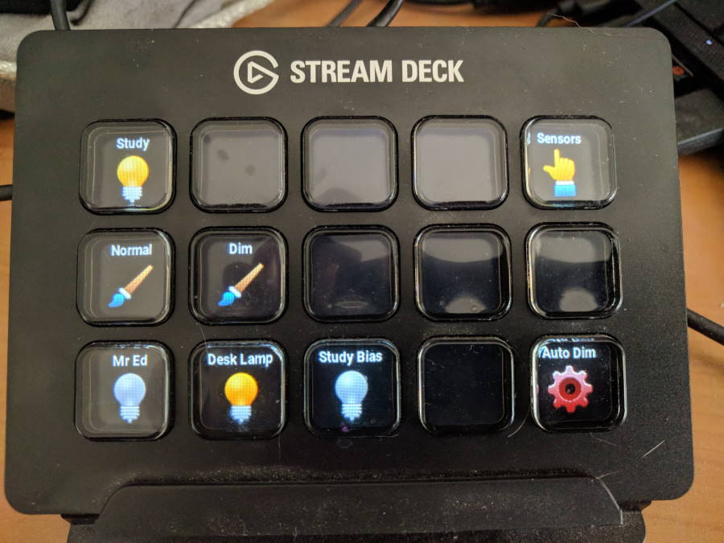

# Python Elgato HomeAssistant Client



This is an open source Python 3 application to control a
[Home Assistant](http://home-assistant.io) home automation instance remotely,
via an [Elgato Stream Deck](https://www.elgato.com/en/gaming/stream-deck). This
client is designed to be able to run run cross-platform, so that the StreamDeck
can be connected to both full PCs as well as stand-alone Raspberry Pis.

Unlike the official software client, which can be made to integrate with Home
Assistant via it's "Open Website" command macros, this client supports dynamic
updates of the button images to reflect the current entity states.

## Status:

Working - kind of. You can define your own page controller and attach lights and
automation objects to them, which are toggled on or off when the button is
pressed. You can also attach a value adjuster to a button which will just shown
the current value of a given Home Assistant sensor.

This is my first asyncio project, and I'm not familiar with the technology, so
everything can be heavily improved. If you know asyncio, please submit patches
to help me out!

Nothing is robust yet, and I'm hard-coding my own server and IP and entities in
the main client file until I come up with a definition language. Edit these
files to suit your own setup.

## Dependencies:

This library uses my own [python-elgato-streamdeck](https://github.com/abcminiuser/python-elgato-streamdeck)
library to interface with the Stream Deck devices.

You will need to have the following libraries installed:

HIDAPI, for USB HID access:
```
pip3 install hidapi
```
Pillow, the Python Image Library (PIL) fork, for dynamic tile image creation:
```
pip3 install pillow
```
Asynchronous Websockets (AsyncWS), for communication with Home Assistant:
```
pip3 install asyncws
```

## License:

Released under the MIT license:

```
Permission to use, copy, modify, and distribute this software
and its documentation for any purpose is hereby granted without
fee, provided that the above copyright notice appear in all
copies and that both that the copyright notice and this
permission notice and warranty disclaimer appear in supporting
documentation, and that the name of the author not be used in
advertising or publicity pertaining to distribution of the
software without specific, written prior permission.

The author disclaims all warranties with regard to this
software, including all implied warranties of merchantability
and fitness.  In no event shall the author be liable for any
special, indirect or consequential damages or any damages
whatsoever resulting from loss of use, data or profits, whether
in an action of contract, negligence or other tortious action,
arising out of or in connection with the use or performance of
this software.
```
